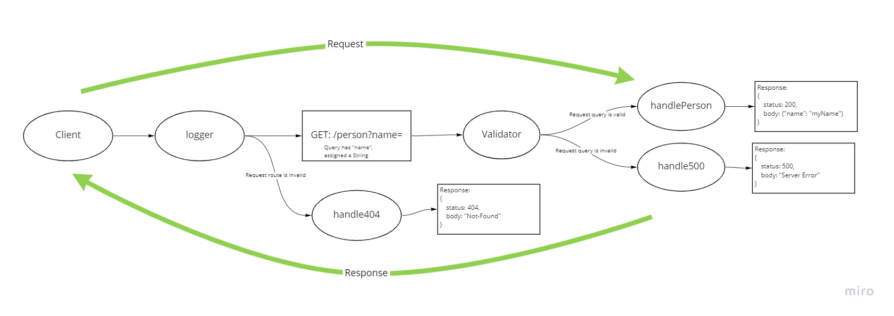

# basic-express-server

A basic express server with one route.

[Deployed API](https://jjtech-basic-express-server.herokuapp.com)

## Installation

1. Clone from this repo `git clone https://github.com/jeffreyjtech/basic-express-server.git`
2. cd into `basic-express-server`
3. `npm install`
4. Optionally, create an .env file with variable `PORT` assigned your preferred port number.
    - The default `PORT` is `3000`.

## Usage

After installation, run `npm start`.

## Contributors / Authors

- Jeffrey Jenkins

## Features / Routes

- GET : `/person?name=myName`
  - Parameters
    - must include a name in the query string with a non-null value.
  - Response
    - status `200`, and string body if parameters look good.
      - body: `{"name": "myName"}`
    - status `500`, if name is not assigned a value in the query string.
